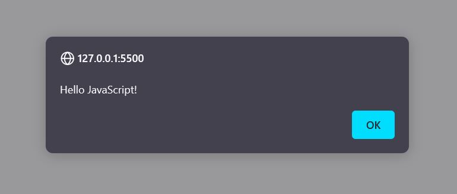
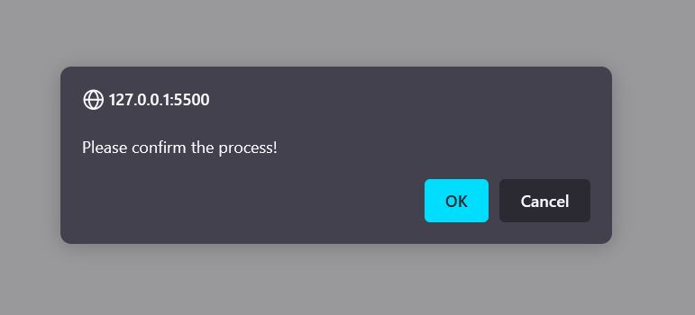
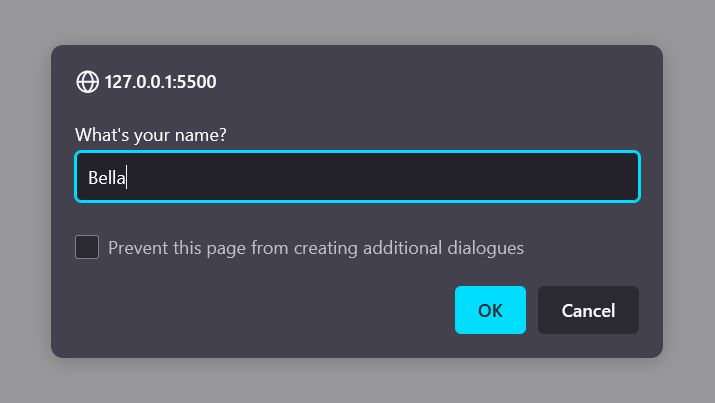
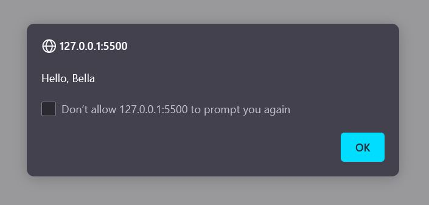
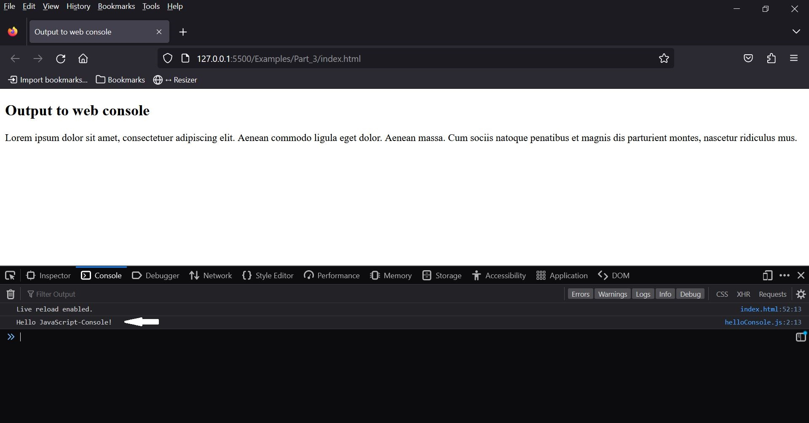
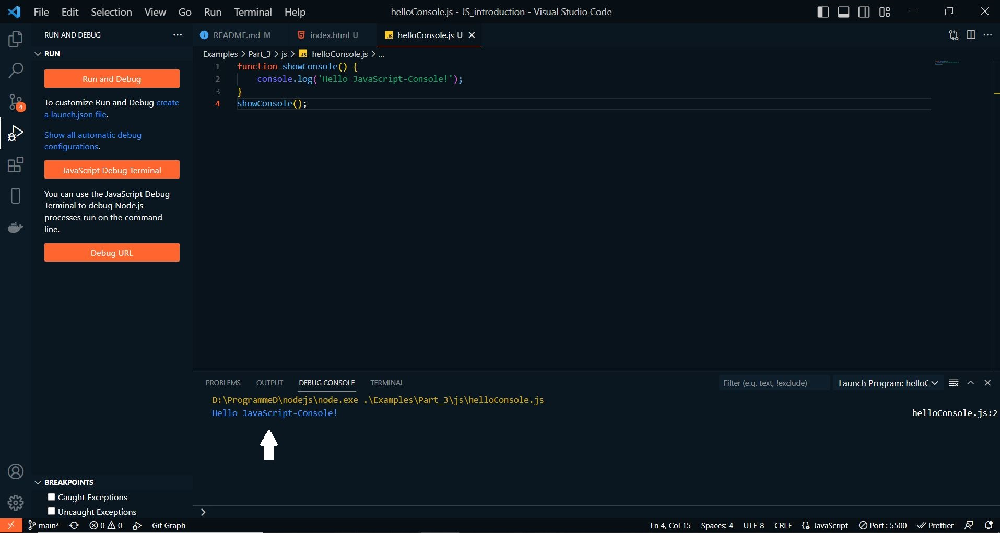
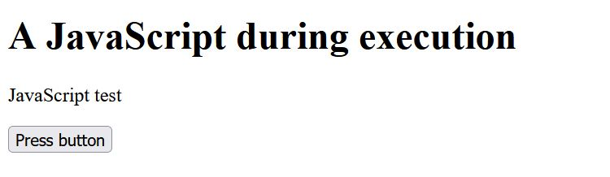
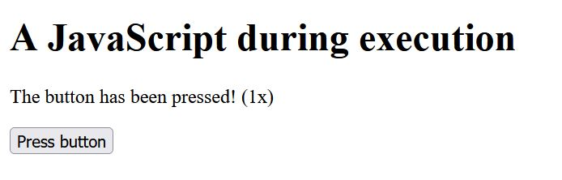
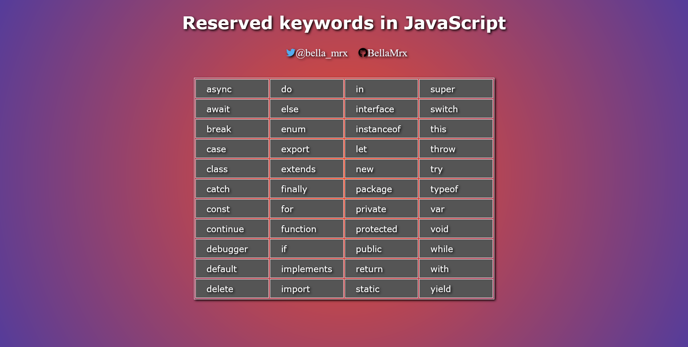
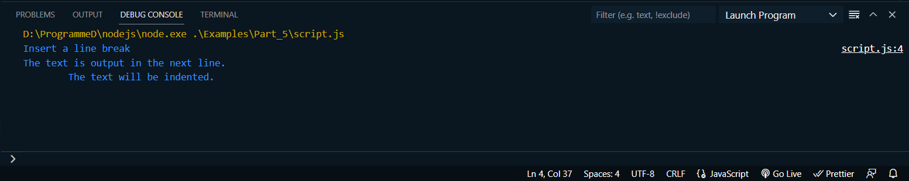

# JS Introduction

 templates and descriptions

---------------------------------------------

## Content
 1. `async` and `defer` - attributes to control the loading behavior of JavaScript
 2. Output from JavaScript
 3. The use of variables in JavaScript
 4. Overview of JavaScript data types
 5. Arithmetic operators for calculation
 6. Conditional statements
 7. Loops - repeat program instructions several times


---------------------------------------------

# 1. `async` and `defer` - attributes to control the loading behavior of JavaScript
- With `async` the download of the JavaScript file takes place ansynchronously, so that the processing of the HTML code is not paused. This executes the JavaScript code directly once it is downloaded. Suitable only for scripts that work independently of the HTML document.

    ```
    <script src="script.js" async></script>
    ```

- With `defer` the JavaScript code is not executed until the HTML code has been completely processed. 

    ```
    <script src="script.js" defer></script>
    ```

If neither `async` or `defer` is present: The script is downloaded and executed immediately, blocking parsing until the script is completed.

- If the user has JavaScript disabled, or the web browser does not support JavaScript, a special hint can be given to the user with `<noscript>...</noscript>`.

--> **Examples/Part_1/index.html**
    
   ```
    <script src="js/hello.js" defer></script>
    <noscript>
        JavaScript is not available or it is disabled. <br />
        For optimal use of this website it is recommended to 
        to use a browser like JavaScript or enable JavaScript 
        in your browser.
    </noscript>
   ```

--------------------------------------------

# 2. Output from JavaScript
## Standard dialogs
- `alert()`, the function outputs the text passed between the brackets in a hint dialog.

--> **Examples/Part_1/js/hello.js**
    
   ```
    function showHallo() {
        alert('Hello JavaScript!');
    }

    showHallo();
   ```

 

- `confirm()`, is the classic OK cancel dialog with two buttons.

- `prompt()`, is the dialog for entering text.

--> **Examples/Part_2/js/demo.js**
    
   ```
    function showConfirm() {
        confirm('Please confirm the process!');
    }

    function showPrompt() {
        var result_text = prompt("What's your name?", "");
        if (result_text == "" || result_text == null)
            history.back();
        else
            alert("Hello, " + result_text);
    }

    showConfirm();
    showPrompt();
   ```
confirm()

 

prompt()

 

 

These standard dialogs are rarely used in practice, it depends on the layout and because the application possibilities are very limited. Moreover, the web browser may ignore them if they are displayed repeatedly.


## Output to the console
With `log()`, a method of the `console` object, a simple console output can be generated. However, such a log output in the console is not intended for the user, but for the developer, in order to trace the sequence of individual program sections or to find errors.

--> **Examples/Part_3/js/helloConsole.js**
    
   ```
    function showConsole() {
        console.log('Hello JavaScript-Console!');
    }
    showConsole();
   ```

in the web browser:

 

Besides `console.log` there are other categories of output:

   ```
    console.log('A log message');
    console.warn('A warning message');
    console.info('An information');
    console.error('An error message');
   ```

All functions can be used like `console.log`, only the output in the web console usually changes style.

It is also possible to start the JavaScript code directly from the runtime environment, but for this [Node.js](https://nodejs.org) must be installed on the computer. After installing it you can start the code with *node* (in Visual Studio Code: Run -> Start Debugging -> select "node.js").

 

However, the output via the `console` object should only be used during development. Even if the visitors usually do not see this output, the output to the console should no longer be used in the finished website. Some web developers therefore use special logging libraries, with which one can switch the logging information on or off at any time with appropriate configuration.


## Output to the website
The output with standard dialogs is not very nice and the output via `consol.log` is only for developers. So for the user of the website a different output has to be created. That's where the HTML elements and attributes come into play, so a classic input/output can be done directly in a text field up to a DOM manipulation to create an output (where the web page or parts of it are changed dynamically at runtime).

--> **Examples/Part_4/js/pushButton.js**
    
   ```
    let counter = 1;

    function changeText() {
        document.querySelector('p').innerHTML =
            "The button has been pressed! (" + counter + "x)";
        counter++;
    }
   ```

Once the `button` has been pressed, a `click` event is fired, whereupon `onClick="changeText()"` executes the JavaScript with the `changeText()` function. The function changes the content of the first `p` element found and replaces the text in between with `"The button has been pressed! (1x)"`, increasing the value of `counter` by 1 after each new confirmation.

Before pressing the button:

 

After the button is pressed:

 


### Comment JavaScript code
It is helpful to add comments to the JavaScript code to be able to understand later what is happening there.

A one-line comment:

   ```
    // One comment
    // console.log('One comment') 
   ```

A multi-line comment:

   ```
    /* A comment,
	   that extends over
       several lines */
   ```

-------------------------------------------

# 3. The use of variables in JavaScript
Variables are declared in JavaScript using either the `let` or `var` keyword, the variable name is followed by a `=` character and the value.
Such variable initialization is done as in algebra:

   ```
    let price = 10;                     // Number
    let pi = 3.14;                      // Number
    let aMessage = "Message";           // String
    let userName = 'Rick Sample';       // String
    let num = 12345;                    // Number
   ```

The variable name must not have any spaces or special characters and must start with a letter. The underscore `_` can be used as the last character, the `$` is theoretically allowed at the beginning or within the name. There is also a distinction between upper and lower case (`var1` and `Var1` are two different variable names).

A statement is always terminated with a semicolon `;`. An instruction in JavaScript is almost every line of a script. Consequently, statements are also the declaration and initialization of variables or the calling of functions.

JavaScript keywords also cannot be used as variable names, these are:

 

Everything between the single or double apostrophes is recognized as a string by the interpreter:
   ```
    let aText01 = "This is a string";           // String
    let aText02 = 'This is a string';           // String
   ```

Without single or double quotation marks, it is a numeric value:
   ```
    let price = 10;                     // Number
    let pi = 3.14;                      // Number
    let textNum = "1234";                    // Caution! This is a string
   ```

## Initalize and assign values
- create a variable with the keyword `let`
   ```
    let myName;             // agreement of a variable
    console.log(myName);    // Output: undefined                 
   ```

- Such an empty agreed variable without an assigned value has a value, this is `undefined`. With the assignment operator a value can be assigned again at any time:
   ```
    let myName;             
    myName = "Sample";      // Value assignment
    console.log(myName);    // Output: Sample                 
   ```

- or the value can be added immediately:
   ```
    let myName = "Sample";            
    console.log(myName);    // Output: Sample                 
   ```

- Likewise, more than one variable can be declared at once, in one statement, separated by commas:
   ```
    let firstName, lastName, myAge;                           
   ```

- the initialization of several variables:
   ```
    let firstName = "Sample", lastName = "Rick", myAge = 42;
    console.log (firstName + "," + lastName + "," + myAge);     // Output: Rick, Sample, 42                          
   ```

- Variables can also be assigned a new/different value:
   ```
    let firstName = "Rick";
    console.log(firstName);    // Output: Rick    
    firstName = "Richard";
    console.log(firstName);    // Output: Richard                      
   ```

## Define constants
JavaScript can also be used to define constants, for which the keyword `const` is available. The value of such a constant cannot be changed after initialization. In practice, such constants are usually rendered with capital letters:
   ```
    const PI = 3.141592653589793;       // create constant 
    console.log(PI);                    // Output: 3.141592653589793
    PI = 3.14;                          // Error! Constant can no longer be changed.  
    console.log(PI);                    // Uncaught TypeError: Assignment to constant variable
   ```

### `use strict` - strict mode
JavaScript is executed in Standard mode without any precaution. In strict mode some constructs can cause errors that are executable in standard mode without any problem, because there are some restrictions in strict mode. This sounds bad at first, but since JavaScript is very fault tolerant, the website may work locally, but as soon as the website is hosted, errors may occur. And that's where the `use strict` mode is helpful, because it doesn't allow these errors from the beginning.

To enable strict mode, it is enough to write this statement at the beginning of the JavaScript program:
   ```
    "use strict";

    // JS code
   ```

Example:
   ```
    "use strict";
    text = "A Message";     // strict mode error
    console.log(text);      // ReferenceError: text ist not defined
   ```


--------------------------------------------

# 4. Overview of JavaScript data types
In JavaScript, no data type needs to be specified during variable declaration, unlike other languages such as C++ or Java. Since the data type in JavaScript is determined at runtime based on the value passed.

JavaScript defines several data types. 
- The primitive types: *string*, *number*, *boolean*, *symbol*.
- special types: *undefined*, *null*
- composite data type: *object* 

The type of a variable is returned with the *typeof* operator. Possible return values are *string*, *number*, *boolean*, *object*, *function*, *symbol* and *undefined*.


## data type *number*
In JS, there is no difference between integers and floating point numbers. All data types for numbers are internally represented by JS as 64-bit floating point values.
   ```
    let integerValue = 12345;
    console.log (typeof integerValue);              // Output: number
    let floatingPoint_Value = 123.456;
    console.log (typeof floatingPoint_Value);       // Output: number
   ```

If a value does not correspond to a correct numerical value, *NaN (not a number)* is used as the value. If the value range has been exceeded or fallen below, *Infinity* or *-Infinity* is used as the value. Therefore there are two constants *Number.POSITIVE_INFINITY* and *Number.NEGATIVE_INFINITY*. If the smallest or largest possible number is to be determined, the constants *Number.MIN_VALUE* and *Number.MAX_VALUE* are used.
   ```
    console.log (Number.MIN_VALUE);              // Output: 5e-324
    console.log (Number.MAX_VALUE);              // Output: 1.7976931348623157e+308
    console.log (Number.POSITIVE_INFINITY);      // Output: Infinity
    console.log (Number.NEGATIVE_INFINITY);      // Output: -Infinity
   ```

When specifying floating point numbers, a period must be used instead of a comma. For higher or smaller floating point numbers, E-notation can be used. A specification of **5e-3** corresponds to **0.005**.
   ```
    let floatingPoint_Value_1 = 5e-3;
    console.log (typeof floatingPoint_Value_1);       // Output: 0.005
    let floatingPoint_Value_2 = 1.2e4;
    console.log (typeof floatingPoint_Value_2);       // Output: 12000
   ```


## data type *string*
*Strings* are used to represent text and consist of a string of 0 or more 16-bit characters. Such string literals can be inserted in JS by placing a text between single or double quotes.
   ```
    let text1 = "String in JS";
    console.log (typeof text1);            // Output: string
    let text2 = "Another string in JS";
    console.log (typeof text2);            // Output: string
    let text3 = "1234";
    console.log (typeof text3);            // Output: string
   ```

Escape sequences are control characters that can be inserted in strings as variable values. Such control characters are introduced with \ followed by the letter marking the control character. 

--> **Examples/Part_5/script.js**

   ```
    let text4 = "Insert a line break\n";      // Line break at the end
    let text5 = "The text is output in the next line. \n";   
    let text6 = "\tThe text will be indented.\n";
    console.log (text4 + text5 + text6);
   ```
Output:

 

The most important control characters

| control character | meaning                                                    |
|------------------ | -----------------------------------------------------------|
| `\'`              | a single quote within the string                           |
| `\"`              | double quotation mark within the string                    |
| `\\`              | backslash character within the character string            |
| `\n`              | line break in JS on console, for web pages `<br>` applies  |
| `\t`              | tab character, one indent to the right                     |
| `\uXXX`           | this adds a Unicode symbol                                 |


Single strings are linked with the + operator:
   ```
    let text7 = "to be";
    let text8 = "not";   
    let text9 = text7 + "or" + text8 + text7;
    console.log (text9);                       // Output: to be or not to be
   ```

When mixing numbers and strings with the + operator, the result will always be a string:
   ``` 
    let text10 = "The value is: " + 199,99 + 100;
    console.log (text10);                       // Output: The value is 199,99100
   ```

### Template strings
These are string symbols that may span multiple lines and also allow embedded JavaScript expressions. Such template strings are enclosed between two grave accents``` ` ```. This makes it possible to do without line breaks with `\n`:
   ``` 
    let text11 = "last line";
    console.log("first line\n" + "second line\n" + text11);
    // first line
    // second line
    // last line
   ```
the same:
   ``` 
    console.log(`first line
    second line
    ${text11}
    `)
   ```

To insert JavaScript expressions into the strings, the notation `${expression}` is used (expression here `text11`).


## data type *boolean*
The Boolean data type can hold only two values, *true* and *false*. A boolean value is a truth value and usually expresses the validity of a condition. Conditions that contain the value 0, an empty *string*, *NaN*, *undefined* or *null* are also interpreted as *false*. All other values are *true*.
   ``` 
    let val1 = 123;
    let val2 = 456;
    console.log(val1 > val2);    // Output: false
    console.log(val1 < val2);    // Output: true

    let isAdmin = false;
    let isUser = true;
   ```


## Data type *undefined* and *null*
A variable that has not yet been assigned a value has the value *undefined*. Also a non-existing object property or non-existing function parameters have the value *undefined*.
   ``` 
    let name;
    console.log(name);     // Output: undefined
    let name = "Rick Sample";
    console.log(name);     // Output: Rick Sample    
   ```

With the data type *null*, on the other hand, an empty object is represented:
   ``` 
    let name = {
      fname: 'Rick',
      lname: 'Sample'
    };
    console.log(name);     // Output: {fname: "Rick", lname: "Sample"}
    name = null;
    console.log(name);     // Output: null
   ```

The data type *null* is a keyword. The type *null* was listed as a data type, but a *typeof null* returns the type *object*. Variables that are initalized with *null* are *object* types. A variable that is not initalized, on the other hand, is *undefined*. The value *undefined* simply indicates that a variable has not yet been initialized with a value. *null*, on the other hand, is an empty object.


## Data type *object*
Objects are a collection of properties and methods. A method is a function and a property, value or set of values of an object. 
   ``` 
    let name = {
      fname: 'Rick',
      lname: 'Sample'
    };
    console.log(name);     // Output: {fname: "Rick", lname: "Sample"}
   ```

## Convert data types
In this example, the + operator has output the value as a string.
   ``` 
    let text10 = "The value is: " + 199,99 + 100;
    console.log (text10);                       // Output: The value is 199,99100
   ```

However, this only applies to the `+` operator in conjunction with strings. If other operators like `-`, `*` or `/` are used, JavaScript does not convert the numbers into strings anymore, but tries to convert the strings into numbers.
   ``` 
    let text12 = "100" - 42;                    // 58
    console.log(typeof text12);                 // Output: number
    let text13 = "100" + 42;                    // "10042"
    console.log(typeof text13);                 // Output: string
    console.log("6" / "2");                     // Output: 3
   ```

JS cannot know on its own which data type is to be used.  For such purposes JS offers the function `parseInt()` and `parseFloat`. With `parseInt()` a string is converted into an integer. With `parseFloat` a string is converted into a floating point number.
   ``` 
    let iVal = parseInt("100") + 42;         // 142
    console.log(typeof iVal);                // Output: number
   ```

--------------------------------------------------

# 5. Arithmetic operators for calculation
Arithmetic operators are for example `+`, `-`, `*`, `/` or `%`.

   ``` 
    let val1 = 101 + 202;
    console.log(val1);                    // Output: 303
    console.log(88 - 46);                 // Output: 42
    let val2 = val1 * 3;
    console.log(val2);                    // Output: 909
    console.log(val2 / 9);                // Output: 101
   ```

Here, too, as in mathematics, the dot before dash rule applies.
   ``` 
    let val3 = 100 / 2 - 5 * 4;
    console.log(val3);                // Output: 30
   ```

   ``` 
    let val4 = 5 + 6 * 2;                    // 17
    let val5 = (5 + 6) * 2;                  // 22
   ```

In JS there is a *Math* object which can be used for various mathematical functions. Generally this function should be used if no rounding errors should occur. With `Math.random()` a random number is returned. Or `Math.sqrt(x)` which returns a square root of x.


-------------------------------------------------------

# 6. Conditional statements
Conditional statements affect the flow of the program by defining a condition and then using it to decide at what point the program will continue.

- `if` : is used to branch a block of statements that will be executed only if the condition in the `()` parenthesis is equal to `true`.

- `else` : is used with a block of statements that will only be executed if the previously checked `if` condition is equal to `false`.

- `else if` : is used with a block of statements to test another condition if the preceding `if` was equal to `false`. Multiple `else if` can be used after a preceding `if`. Alternatively, `switch()` can be used for such multiple branches.

   ``` 
    if (condition == true) {
      // statement if condition equals true
    } else  {
      // statement if condition equals false
    }
   ```

## `true` or `false`
A boolean truth value in JS is specified as `true` or `false`, anything containing a true value equals `true` and anything without a true value equals `false`. But in JS you are not limited to `true` and `false`. There are also values that are considered false, such as `undefined`, `null`, `0` or `""`(falsy). `true` can also be objects (without properties), functions or arrays.

- Real values so `true` are for example:
   ``` 
    1234
    1.234
    -1
    "One text"
    4 + 2 * 3
   ```

   ``` 
    let mytext = 'One text';
    if (mytext) {
      console.log('"mytext" is a valid text.');       // Output
    } else {
      console.log('"mytext" is an invalid text.');
    }
   ```

 Since the `if` condition equals `true`, so `mytext` is a valid value, the corresponding output in the brackets of the `if` condition is executed.

- No real values so `false` are for example:
   ``` 
    0             // The number 0
    ""            // empty string
    var val01;    // empty variable is undefined
    var val02 = false;
    60 / "text"   // NaN
    null          // always false
    NaN           // Not a number
   ```

   ``` 
    let mytext = 'One text';
    let val01 = 60;
    if (val01 / mytext) {
      console.log('Calculation successful');
    } else {
      console.log('NaN -> no valid value');
    }
   ```

 Here the statements are executed in the alternate `else` block because the `if` condition returns `false`.


## Comparison operators
Besides `true` and `false`, variables and values can be compared with the different comparison operators to check if they are true or false.

| Operator  | Description                       | Example (x=6; y=5)                   |
|---------- | --------------------------------- | ------------------------------------ |
| `==`      | equal to                          | `x == 5; // false`                   |	
| `!=`      | not equal to                      | `x != 5; // true`                    |
| `==`      | same value and same type          | `x === y; //false`, `x === 6; //true`  |
| `!==`     | different value or different type | `x !== y; //true`, `x !== 6; //false`  |
| `>`       | greater than                      | `x > y; //true`                      |
| `<`       | less than                         | `x < y; //false`                     |
| `>=`      | greater than or equal to          | `x >= y; //true`, `x >= 6; //false`    |
| `<=`      | less than or equal to             | `x <= y; //false`, `x <= 6; //true`    |

The comparison operators `==` and `!==`. These are necessary because with comparison operators an implicit type conversion is performed before the comparison so that these values can be compared.

## Use `if` branches
--> **Examples/Part_6/script.js**

   ``` 
    let age = prompt('How old are you');
    if (age >= 18) {
      console.log('Access allowed');
    } else {
      console.log('Access denied');
    }
   ```
If the age is 18 or higher, access is granted, if not then no access.

   ``` 
    let strVal = "1234";
    let iVal = 1234;
    if (strVal == iVal) {                    // true, because type conversion
      console.log("Both values are equal");     
    } else {
      console.log('Values are different');
    }
   ```
Due to the type conversion `true` is returned. If `==` is replaced by `===`, `true` is no longer returned because the value is the same but the type is not.


## Use selection operator
An `if-else` construct can be shortened with the so-called selection operator. The structure is as follows:
   ``` 
    let val = condition ? value1 : value2;
   ```
means the same as: 

   ``` 
    let val;
    if (condition) {
      val = value1;
    } else {
      val = value2;
    }
   ```
Here the value `value1` is assigned to the variable `val` if `condition` is equal to `true`. If `condition` is equal to `false`, the `value2` is assigned to `val`.

another example:

   ``` 
    let pwd = prompt ('Enter password: ');
    let isAdmin = pwd == 123456789 ? true : false;
    console.log(isAdmin);
   ```
Here with `prompt()` a pseudo-password is queried and assigned to the variable `isAdmin` according to the input `true` or `false`.


## Logical operators
The logical operators in JS are `&&`(AND), `||` (OR) and `!` (NOT). Logical operators are used with truth values. If you use numbers, they are implicitly converted to a truth value before they are linked with `&&`, `||` or `!`.

- `&&` : Expressions linked with the AND operator return `true` only if all expressions are true: 
   ``` 
    if (ival1 > 0 && ival2 > 0) {
      // Both expressions are true
    }
   ```

- `||` : Expressions concatenated with the logical OR operator return `true` if at least one of the expressions is true:
   ``` 
    if (ival1 > 0 || ival2 > 0) {
      // At least one expression is true
    }
   ```

- `!` : The logical NOT operator is used to negate an expression. From `true` can be made `false` and reverse:
   ``` 
    if (!(ival > 0)) {
      console.log("ival is not greater than 0")
    }
   ``` 

example:
   ``` 
    let val = prompt('Enter a value from 1 - 100: ');
    if (val >= 1 && <= 100) {
      console.log("The value meets the requirements.")
    } else {
      console.log("Incorrect input: + val");
    }
   ```
Using the logical AND, here the expressions (whether the entered value `val` is equal to or greater than 1 AND equal to or less than 100) have been linked, and only `true` is returned if both expressions are `true`.
If the logical OR operator had been used instead, `true` would always be returned (if the entered value is greater than or equal to 1), because the second expression would not have been checked at all. But if the value is negative or 0, the OR operator will also evaluate the second expression. If the logical OR operator is used, the check is aborted at the first `true`, because the condition is that at least one operator is true.


## Multiple branching with `switch`
If several conditions are to be checked, theoretically several `if` queries can be used one after the other. Or you can use the `switch` case distinction. In JS, `switch` supports values with arbitrary types. It is also possible to have values determined dynamically first via function calls.

   ``` 
    switch(expression) {
      case label_1:
         statement;
         [break];
      case label_2:
         statement;
         [break];
    ...
      default:
         statement;
    }
   ```

With this case distinction, a matching value in `case` is searched for the expression in `switch`. If a `case` marker matches the `switch` evaluation, the program execution is executed after this `case` marker. If no `case` marker matches the `switch` evaluation, an optional `default` marker can be used, which will be executed as an alternative. Of particular importance in a `switch` case distinction are the `break` statements at the end of a `case` mark. `break` is used to instruct the program to jump out of the `switch` block and continue with the program execution after it. If no `break` statement is used, all further statements in the `switch` block are executed until the next `break` statement or until the end of the block.

   ``` 
    switch(new Date().getDay()) {
      case 0:
         console.log("Today is Sunday")
         break;
      case 6:
         console.log("Today is Saturday")
         break;
      default:
         console.log("Today is a weekday")
    }
   ```

Here in `switch` a `Date` object is created and with it the method `getDay()` is called. The method `getDay()` returns a weekday in the form of a number. 0 is returned for Sunday, 1 for Monday etc to 6 for Saturday. In the example the return value is compared with the `case` marks 0 and 6. If one of the marks matches, a corresponding output is returned in the JavaScript console. If none of the `case` marks match, the return value is 1,2,3,4,5 and it is a normal weekday, so no `case` marks are used here anymore, but `default`.


------------------------------------------

# 7. Loops - repeat program instructions several times
Loops are good for repeating certain statements multiple times. JS supports several types of loops:

## Increment and decrement operator
Here the value of a variable is increased or decreased by 1. Mainly these two operators are used with loops.

| Operator | Meaning                                           |
| -------- | ------------------------------------------------- |
| `++`     | Increment operator; variable is incremented by 1  |
| `--`     | Decrement operator; variable is decreased by 1    |

There are two options for use in each case:

| Using       | Meaning                                           |
| ----------- | ------------------------------------------------- |
| `val++`     | Postfix notation; increments the old value of `val`, still passes the old value to the current expression |
| `++val`     | Prefix notation; increments the old value of `val` and passes it immediately to the current expression  |
| `val--`     | Postfix notation; reduces the value of `val`, still passes the old value to the current expression |
| `--val`     | Prefix notation; reduces the value of `val` and passes it immediately to the current expression |


   ``` 
    let iVal = 1;
    console.log("iVal = " + iVal);          // Output: iVal = 1
    ival++;
    console.log("iVal = " + iVal);          // Output: iVal = 2
    console.log("iVal = " + iVal++);        // Output: iVal = 2
    console.log("iVal = " + iVal);          // Output: iVal = 3
    console.log("iVal = " + ++iVal);        // Output: iVal = 4
   ```


## `for` loop
The flexible `for` loop is probably the most commonly used loop.
   ``` 
    for(Initialization; condition; increment/decrement) {
      // Statement block that will be executed
    }
   ```

Initalization is executed only once when the loop is started and is usually used to set a counter variable for the loop. As long as the condition equals `true`, the loop is executed again. If `false`, the loop is terminated and program execution continues after the statement block of the `for` loop. As a condition it is often checked whether the counter variable corresponds to a certain value. Increment/Decrement is always executed when the statement in the statement block have been executed.

   ``` 
    for(let i = 0; i < 3; i++) {
      console.log(i + 1 + "-th loop pass");
    }
   ```

Output to the console: 

   ``` 
    1st loop pass
    2nd loop pass
    3rd loop pass
   ```

Here the statement was executed three times in the loop. The count variable `i` was first set to `0`, the condition `i<3` was checked and then the statement block behind it was executed. The output in the JS console shows how many times the loop has been executed. Next,the loop variable is incremented by 1 with `i++` and the condition `i < 3` is checked again, which (i = 1) is still `true`. The process is repeated until the of `i` equals 3 and thus the condition `i < 3` returns `false`.

All three expressions in the `for` loop are optional and can be omitted. In any case, the two semicolons in the `for` loop must be used. Theoretically, `for(;;)` would be a valid `for` loop. However, an infinite loop is created if the second expression is omitted, which can cause the browser to crash. If such an infinite loop is used, a `break` should be used inside this loop.


## `while` loop
The `while` loop is a header driven loop and will be executed as long as the condition in `while` returns `true`.

   ``` 
    while(condition) {
      // Statement block that will be executed
    }
   ```

example:

   ``` 
    let i = 0;                   // Initialize counter variable
    while(i < 3) {               // Check condition
      console.log(i + 1 + "-th loop pass");
      i++;                       // Increase counter variable
    }
   ```


## `do-while` loop
The `do-while` loop is a foot-controlled loop, which means that the condition is not checked until the end, when the statement block has been executed. Thus, in the `do-while` loop, the statement block of the loop is executed at least once before the condition is checked.

   ``` 
    do {
      // Statement block that will be executed
    } while(condition);
   ```

example:

   ``` 
    let i = 0;
    do { 
      console.log(i + 1 + "-th loop pass");
      i++;
    } while(i < 3);
   ```


## End statement block with `break
A statement that may be useful in a loop is the `break` statement. If a simple `break` is used within a statement block of the loop, it will jump out of the loop execution and the script will continue behind the loop.

   ``` 
    let i = 0;
    while(i < 8) {
      console.log(i + 1 + "-th loop pass");
      i++;
      if (i === 4) {
         console.log("End loop with break");
         break;
      }
    }
   ```

Actually, this loop should be run through 8 times in `while`. However, this loop is only run through 4 times, because then the if-condition `i === 4` returns `true` and thus the `break` statement ensures that the loop is ended prematurely.


## Jump to loop start with `continue`
With `continue` a loop pass can be terminated and then jump back to the loop start. This is helpful if due to a condition the further loop pass should not be executed.

   ``` 
    let i = 0;
    while(i < 10) {
      i++;
      if (i % 2 === 1) {
         continue;
      }
      console.log("Value divisible by 2: " + 1);
    }
   ```

In the example, a loop is incremented from 1 to 10 and passed through. At each loop pass it is checked whether the value of `i % 2` results in a remainder. If the condition is `ture`, `continue` jumps back to the beginning of the loop. If the condition is `false`, it is a number divisible by two or an even value, and the number is output.


---------------------------------------------------------------------

On my Twitter account [@bella_mrx](https://twitter.com/bella_mrx) you can find more useful stuff about HTML and web development. 

Or check out my [GitHub](https://github.com/BellaMrx) profile.

Thanks for reading. 
I hope you enjoyed it or at least learned something.


